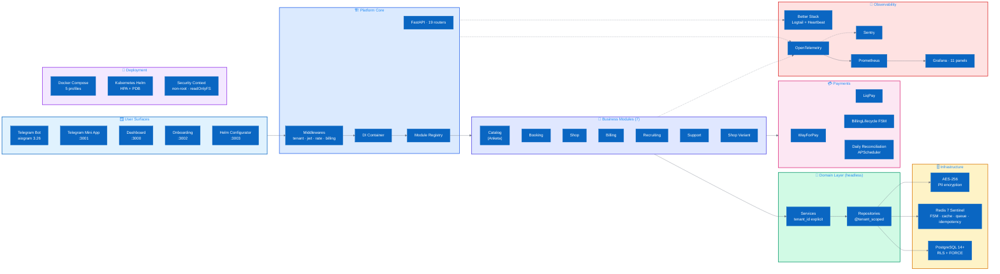

<div align="center">


# SmartHire — Architecture Showcase

### Production patterns from a Multi-tenant B2B SaaS handling 1000+ tenants in a single runtime

Це публічна частина архітектури реальної SaaS-платформи: ADR, code samples,
інженерні рішення. Source code закритий з комерційних причин — те, що нижче,
дає достатньо, щоб зрозуміти, як платформа спроєктована і чому саме так.

[](pyproject.toml)
[](https://fastapi.tiangolo.com/)
[](https://docs.aiogram.dev/)
[](#multi-tenancy-три-шари-захисту)
[](https://docs.sqlalchemy.org/)
[](dashboard/)
[](helm/smart-os/)
[](docs/infrastructure.md)

[**Quick scan**](#quick-scan-30-секунд) ·
[**Inside**](#inside-the-platform) ·
[**Engineering deep-dives**](#engineering-deep-dives) ·
[**Beyond patterns**](#beyond-the-patterns-повна-карта) ·
[**Numbers**](#numbers-that-matter) ·
[**ADR**](adr/) ·
[**Контакти**](#контакти)

</div>

---

## Quick Scan (30 секунд)

| | |
|---|---|
| **Що це** | Multi-tenant SaaS на Telegram + Web. 1 бот, 4 фронтенди, FastAPI, K8s |
| **Масштаб** | 1000+ тенантів в одному runtime, < 20% degradation під load |
| **Кодова база** | ~85k LOC Python + ~40k LOC TypeScript, 33 ADR, 7 модулів, 19 API роутерів |
| **Інженерна основа** | PostgreSQL RLS, headless service layer, basis-point money, AES-256 PII, zero-downtime deploys |
| **Бізнес-функції** | Multi-payment (WayForPay + LiqPay), White Label з YAML, self-service onboarding, billing з grace period |
| **Що відкрито тут** | ADR, sanitized code samples, архітектурні діаграми, deployment configs |
| **Що закрито** | Source code, business logic, client configs, secrets |

**Маршрути для читача:**
- 5 хвилин → [топ-патерни](#engineering-deep-dives)
- 15 хвилин → [патерни + повна карта](#beyond-the-patterns-повна-карта)
- 30 хвилин → читай по порядку, починаючи з [ADR-001](adr/001_multi_tenant_architecture.md)

---

## Inside the Platform

SmartHire — не один моноліт, а композиція з 9 функціональних доменів. Нижче — карта,
яка дає розуміння за 60 секунд, що насправді всередині.



Кожен домен — самостійна область з власною дисципліною і ADR.
Далі по тексту — детальний розбір того, що в кожному.

---

## Engineering Deep-Dives

Шість архітектурних рішень, які найбільше вплинули на надійність системи.
Кожне — окремий ADR з обґрунтуванням, trade-off'ами і кодом.

### 1. Multi-tenancy: три шари захисту

<p align="center"></p>

[`ADR-001`](adr/001_multi_tenant_architecture.md) · [`code/tenant_query_builder.py`](code/tenant_query_builder.py) · [`code/rls_migration.sql`](code/rls_migration.sql)

Shared schema + `tenant_id` — найдешевша модель multi-tenancy, але без захисту небезпечна.
У SmartHire працює defense in depth:

| Шар | Що захищає | Що буває, якщо обійти |
|---|---|---|
| HTTP middleware | Витягує tenant_id з JWT, ставить у contextvar | Cron job може обійти — є наступний шар |
| ORM (`@tenant_scoped`) | Автоматично інжектить `WHERE tenant_id` | Raw SQL обходить — є RLS |
| PostgreSQL RLS (`FORCE`) | Останній рубіж на рівні БД | Обійти не можна, тільки через окрему `BYPASSRLS` роль |

Ключовий нюанс: без `FORCE ROW LEVEL SECURITY` власник таблиці ігнорує policy.
Усі, хто впроваджував RLS вперше, на цьому горіли.

### 2. Headless Service Layer

[`ADR-0032`](adr/0032_service_layer_enforcement.md) · [`code/service_layer_example.py`](code/service_layer_example.py)

Жорстке правило: handler'и (aiogram і FastAPI) не імпортують з `core/database/` або `core/repositories/`.
Перевіряється кастомним ruff-rule на pre-commit. Service приймає `tenant_id` явно.

Результат: один і той же `AnketaService.create()` працює з Telegram-команди, REST endpoint,
cron-job і unit-тесту без mock'а Telegram.

### 3. Money as Integers (basis points)

[`ADR-0014`](adr/0014_money_basis_points.md) · [`code/money.py`](code/money.py)

`float` для грошей — баг за визначенням. У SmartHire `Money.amount_kopecks: int`,
відсотки — basis points (`commission_bp: int = 250` = 2.5%), `Decimal` тільки на границях.
Кастомний ruff-rule забороняє `float` у `core/payments/`.

### 4. Webhook Reliability + Daily Reconciliation

[`ADR-0019`](adr/0019_payment_idempotency.md) · [`code/webhook_validator.py`](code/webhook_validator.py)

Жоден провайдер платежів не гарантує exactly-once delivery. Три механізми:

- HMAC підпис + IP allowlist
- Idempotency через Redis `SETNX webhook:processed:{event_id}`
- Щоденна reconciliation з API банку: APScheduler-job о 03:00, Excel-звіт у Telegram оператору

Webhook — лише один з тригерів. Source of truth — стан після reconciliation.

### 5. Module Federation

<p align="center"></p>

[`ADR-005`](adr/005_module_federation.md) · [`code/base_module.py`](code/base_module.py)

`BaseModule` ABC з контрактом на 4 методи (`setup`, `get_catalog_items`, `get_routes`, `get_health`).
`ModuleRegistry` підхоплює модулі при старті. Жоден модуль не імпортує інші — Redis pub/sub event bus.

Per-tenant вмикання через DB-config: тенант А `[catalog, billing]`, тенант B `[booking, shop, support]`.
Toggle у Dashboard, миттєво, без релізу.

### 6. Zero-Downtime через Helm + Expand-Contract

[`ADR-0028`](adr/0028_zero_downtime_deployments.md) · [`code/helm_values.yaml`](code/helm_values.yaml)

Helm chart з HPA (1-5 реплік), PDB = 1, pre-install hook для `alembic upgrade head`.
Readiness probe перевіряє 4 залежності: PostgreSQL, Redis, Telegram API, payment provider.

Дисципліна міграцій — only backward-compatible:

```
Реліз N:   expand   — додаємо колонку, код пише в обидві
Між        backfill — переливаємо старі дані
Реліз N+1: contract — код читає з нової
Реліз N+2: drop     — DROP COLUMN
```

---

## Beyond the Patterns: повна карта

Шість патернів вище — те, що найважливіше показати. Але платформа на 1000+ тенантів
складається з десятків додаткових систем. Нижче — стислий overview всього іншого,
що не увійшло в deep-dives, але є в проді.

### 🪟 User Surfaces (5 entry points)

Не один Telegram-бот, а п'ять окремих поверхонь з різними вимогами:

- **Telegram Bot** (aiogram 3.26) — основний канал для кінцевих користувачів. FSM на Redis,
  middleware pipeline (auth → tenant → rate limit → billing check), 7 бізнес-модулів.
- **Telegram Mini App** (React + TS, port 3001) — повноцінний веб-інтерфейс всередині Telegram
  з автентифікацією через `initData` HMAC.
- **Dashboard** (React 19 + shadcn/ui, port 3000) — control plane суперадміна. 12+ сторінок:
  Overview, Tenants, Onboarding wizard, Modules, Billing, Feature Flags, White Label,
  Analytics, Monitoring, Webhook Migration tracker.
- **Onboarding** (React, port 3002) — self-service лендинг для нових тенантів. 5-кроковий wizard.
- **Helm Configurator** (React, port 3003) — візуальний конструктор `values.yaml` для деплою.

Усі 4 фронтенди працюють паралельно без конфліктів портів. Auth — JWT у httpOnly cookies,
TanStack Query для API, Vite для білдів.

### 🎨 White Label (необмежена кількість брендів)

<p align="center"></p>

Ключова комерційна фіча — один runtime обслуговує необмежену кількість брендів:

- **YAML-конфіги** у `core/white_label/clients/` (статика) або **DB-backed** через `business_config`
  (динаміка, перемикач `WHITE_LABEL_ENABLED`).
- Кастомізація: бренд, логотип, кольори, юр.особа (ФОП реквізити), тарифи, канал, контакти,
  провайдер платежів, оферта, політика приватності.
- Новий бренд — копія YAML + `WHITE_LABEL_CLIENT_ID=acme` + restart. **5 хвилин**.

Приклад `acme.yaml`:

```yaml
brand_name: "HireBot Pro"
owner_name: "ФОП Іваненко О.П."
tariff_amount: 1200.0  # на UI, всередині — копійки
payment_provider: "wayforpay"
offer_link: "https://hirebot.pro/offer"
```

### 🔐 Безпека (не тільки RLS)

<p align="center"></p>

RLS — лише один з шарів. Повна картина:

- **AES-256 для PII** — телефони, email, чутливі поля шифруються в БД
  (ключ + сіль у `.env`, окремо).
- **HMAC для admin callback_data** — захист від підробки інлайн-кнопок у Telegram
  (без HMAC зловмисник може підробити callback з admin-дією).
- **SQL Injection Guard** — `TenantQueryBuilder` парсить запити через `sqlglot`,
  raw-конкатенація заборонена.
- **PII Masking** — `utils/masking.py` маскує телефони/email перед відправкою у Logtail/Sentry.
- **Per-tenant Feature Flags** як kill-switch — небезпечну фічу можна вимкнути на проді
  у конкретного тенанта за 5 секунд через Dashboard, без релізу.
- **Rate Limiting** на Redis — tenant-scoped, per-user, готовий до per-API-key режиму.
- **Pydantic v2 валідація** всього вхідного трафіку.
- **JWT в httpOnly cookies** замість localStorage — захист від XSS.

### 💳 Платіжна інфраструктура

<p align="center"></p>

Не один webhook, а повноцінна billing-система:

- **Два провайдери**: WayForPay (рекомендований, нижчі комісії) і LiqPay (для Privatbank-клієнтів).
  Однаковий інтерфейс, перемикання через `PAYMENT_PROVIDER`.
- **BillingLifecycle FSM** — 5 станів: `pending → paid → active → grace → suspended → reactivated`.
  Грейс-період 3 дні, після — auto-pause бота. Після оплати — auto-resume.
- **BillingScheduler** на APScheduler — щоденні перевірки підписок, нагадування, переходи станів.
- **Excel reconciliation report** — 3 листи (Anketas / Payments / Розбіжності), щоденно у Telegram оператору.
- **Команда `/audit`** — оператор може запустити reconciliation за 24h ad-hoc.
- **Idempotency** на webhook через Redis SETNX (TTL 24h).

### 📊 Observability (повна картина)

Чотири ключові метрики (з deep-dive) — це те, на що дивишся щоранку.
Решта стека:

- **OpenTelemetry SDK** — OTLP export → Tempo (traces) / Jaeger.
- **Prometheus exporter** з tenant-aware labels: 12+ метрик
  (active tenants, messages, payments, DB latency histogram з OLTP-бакетами).
- **Grafana** — 11 панелей, auto-provisioning через Docker Compose, JSON у репо.
- **Sentry** — error tracking з PII filter (нічого чутливого не виходить за межі).
- **Better Stack**: Logtail для structured logs, Heartbeat для uptime monitoring і алертів.
- **Health vs Readiness** — окремі endpoints. Health = "процес живий", Readiness = "DB+Redis+TG+Payment OK".

### 🧪 Тестування (4 рівні)

Не "є тести", а структурована піраміда:

- **Unit** (pytest) — domain logic, services, repositories. Mock'ів мінімум, fakes на in-memory storage.
- **Integration** — реальні Postgres + Redis у Docker, повний flow.
- **Property-based** (`hypothesis`) — для критичних інваріантів (Money arithmetic, tenant isolation,
  state machines). Генерує 10000+ випадків, ловить edge cases, які людина не вигадає.
- **Load** (`locust`) — навантажувальні сценарії на API rate limit, payment flow, dashboard queries.
- **Stress + Smoke** — окремо.

Coverage baseline: 85-95% на критичних модулях (payments, billing, repositories, tenant isolation).

### 🚀 Deployment (5 профілів + Helm)

Docker Compose з профілями:

- `core` — postgres + redis (для розробки фронтів окремо)
- `bot` — тільки бот
- `api` — тільки API
- `dashboard` — тільки фронт
- `all` — повний стек
- Окремо: `docker-compose.monitoring.yml`, `docker-compose.multi-instance.yml` (3 репліки + Sentinel + Nginx LB)

**Kubernetes Helm chart** (`helm/smart-os/`):

- HPA 1-5 реплік (75% CPU/RAM target)
- PodDisruptionBudget = 1 (zero-downtime rollouts)
- Pre-install hook: `alembic upgrade head` ДО старту нових подів
- Security context: `runAsNonRoot: true`, `readOnlyRootFilesystem: true`, `drop: [ALL]` capabilities
- Liveness + Readiness probes з 4 залежностями

### 🛠 DX (developer experience)

- **uv** як менеджер залежностей (Rust, 10-100× швидше за pip).
- **Lefthook** pre-commit: ruff check, ruff format, mypy, bandit security scan.
- **Conventional Commits** обов'язкові, перевірка на CI.
- **Versioning**: `core/version.py` як SSoT, `scripts/run.py release sync` для синхронізації.
- **Feature flags CLI**: `uv run python scripts/run.py dev flags enable <FLAG>` — управління без UI.

### 🧰 Internals

- **Dependency Injection** через `dependency-injector 4.49` — жодних глобальних імпортів сервісів.
- **10 startup-модулів** у `core/startup/` з правильним порядком ініціалізації і teardown.
  Graceful shutdown 30s — drain → close TG session → close pools → exit.
- **Distributed primitives** на Redis: locks, semaphores, idempotency keys, rate limiters.
- **structlog + loguru + rich** для logging з trace_id injection.
- **APScheduler** для billing, reconciliation, cleanup jobs.
- **33 ADR** документують усі нетривіальні рішення в `docs/architecture/`.

---

## Numbers That Matter

Production-цифри замість декларацій:

| Метрика | Значення | Як виміряно |
|---|---|---|
| **Активних тенантів в одному runtime** | 1000+ | `smarthire_active_tenants` Gauge |
| **Performance degradation під full load** | < 20% | Locust, 1000 концурентних користувачів |
| **RLS overhead на запит** | < 5% | EXPLAIN ANALYZE до/після, composite-індекси |
| **p99 DB query duration** | < 50ms | `db_query_duration_seconds` p99, OLTP buckets |
| **Cross-tenant витоки за 18 міс прода** | 0 | RLS + `@tenant_scoped` + middleware |
| **Розходження в quarterly reconciliation** | 0 копійок | Excel report, після переходу на basis points |
| **Час додавання нового White Label бренду** | 5 хв | YAML copy + restart, без релізу |
| **Час додавання нового бізнес-модуля** | 1-2 дні | `BaseModule` контракт, без змін у ядрі |
| **Час deploy без downtime** | ~3 хв | Helm rolling update, HPA + PDB |
| **Coverage критичних модулів** | 85-95% | pytest --cov на payments, billing, repositories |
| **ADR документів** | 33 | `docs/architecture/` |
| **Бізнес-модулів** | 7 | `core/modules/`, всі через `BaseModule` |
| **API роутерів** | 19 | FastAPI, OpenAPI auto-generated |
| **Окремих фронтендів** | 4 | React 19 + Vite, порти 3000-3003 |
| **Telegram FSM-станів** | 50+ | `core/states/`, типобезпечні через `StatesGroup` |

---

## Stack у деталях

### Backend
- **Python 3.12+** — strict typing, modern syntax (PEP 695, match/case)
- **aiogram 3.26** — Telegram bot framework, native async, FSM
- **FastAPI 0.135** + **Pydantic v2** — async API, OpenAPI з коробки
- **aiohttp 3.13** — outbound HTTP (payments, integrations)
- **SQLAlchemy 2.0 async** + **asyncpg** — type-safe ORM
- **Alembic** — міграції з expand-contract дисципліною
- **dependency-injector 4.49** — DI без магії
- **APScheduler** — billing, reconciliation, cleanup

### Data
- **PostgreSQL 14+** — RLS + FORCE, JSONB, `FOR UPDATE SKIP LOCKED` для черг
- **Redis 7 + Sentinel** — FSM, cache, queue, rate limit, idempotency, pub/sub
- **cryptography 46** — AES-256 для PII, HMAC для callbacks
- **sqlglot** — SQL parsing для безпечних admin-запитів

### Frontend
- **React 19** + **TypeScript ~5.8** + **Vite**
- **shadcn/ui** + **TailwindCSS** + **Lucide icons**
- **TanStack Query** — серверний state management
- **JWT в httpOnly cookies** — без localStorage

### Observability
- **OpenTelemetry SDK** (OTLP → Tempo)
- **Prometheus client** + **Grafana** (11 панелей)
- **Sentry SDK** з PII filter
- **Better Stack** (Logtail + Uptime + Heartbeat)

### DevOps
- **uv** — 10-100× швидше за pip
- **Docker Compose** — 5 профілів (dev/staging/prod/monitoring/multi-instance)
- **Kubernetes Helm chart** — HPA, PDB, security context, pre-install migrations
- **Lefthook** + **ruff** + **mypy strict** + **bandit**
- **pytest** + **hypothesis** + **locust** + **schemathesis**

---

## AI-Assisted Development: інженерний підхід

Платформа цього розміру неможлива без AI-інструментів — але "vibe coding" дасть катастрофу.
У SmartHire діє жорсткий протокол `.windsurfrules`, який перетворює AI з генератора boilerplate
на колегу з обмеженими правами і обов'язковою перевіркою.

**Принципи протоколу:**

1. **Quality gate замість trust.** Task DONE тільки коли пройшли: `ruff check . --fix`,
   `ruff format .`, `mypy` без помилок, локальні тести змінених модулів зелені.
   AI не може сказати "готово" без доказів.

2. **ADR before code.** Будь-яка нетривіальна архітектурна зміна починається з ADR.
   AI допомагає писати ADR, але рішення приймає людина.

3. **Service layer enforcement.** AI знає правило: handler'и не імпортують з `database/`.
   Якщо генерує — pre-commit падає, AI отримує feedback і переписує.

4. **Money type discipline.** AI знає: `amount: float` у `core/payments/` — помилка.
   Пропонує міграцію, не додає нові float-поля.

5. **Tenant safety.** Кожен новий repository метод проходить перевірку: чи приймає `tenant_id`
   явно, чи покритий `@tenant_scoped`. AI не може створити repository без цього.

Повний протокол — у [`.windsurfrules`](.windsurfrules) (~200 рядків інженерних правил).
Це не магічний промпт, а дисципліна, вироблена за 18 місяців роботи з AI на проді.

---

## ADR Index

33 архітектурні рішення документовані. Найважливіші для розуміння системи:

| # | Документ | Про що |
|---|---|---|
| 001 | [Multi-tenant Architecture](adr/001_multi_tenant_architecture.md) | Чому shared schema + RLS |
| 005 | [Module Federation](adr/005_module_federation.md) | `BaseModule` + `ModuleRegistry` |
| 0014 | [Money as Basis Points](adr/0014_money_basis_points.md) | `int` копійки + bp |
| 0019 | [Payment Idempotency](adr/0019_payment_idempotency.md) | HMAC + Redis SETNX + reconciliation |
| 0021 | [White Label Configuration](adr/0021_white_label.md) | YAML vs DB-backed brands |
| 0023 | [PII Encryption Strategy](adr/0023_pii_encryption.md) | AES-256 + ключ + сіль |
| 0025 | [Feature Flags as Kill-Switch](adr/0025_feature_flags.md) | Per-tenant runtime toggles |
| 0028 | [Zero-Downtime Deployments](adr/0028_zero_downtime_deployments.md) | Helm + expand-contract |
| 0032 | [Service Layer Enforcement](adr/0032_service_layer_enforcement.md) | Headless: handler ↛ DB |

Повний індекс — [`adr/README.md`](adr/README.md).

---

## FAQ

<details>
<summary><strong>Чому source code закритий?</strong></summary>

SmartHire — комерційний продукт. У showcase публікую те, що дає інженерну цінність
без витоку конкурентної переваги: ADR, патерни, sanitized code samples.
Закрите: бізнес-логіка модулів, інтеграції з клієнтами, deployment configs.
</details>

<details>
<summary><strong>Чи можна використати ці патерни?</strong></summary>

ADR і code samples — під MIT, посилання на репозиторій вітається.
Source code SmartHire — proprietary, не використовується.
</details>

<details>
<summary><strong>Чому PostgreSQL, а не database-per-tenant?</strong></summary>

При 1000+ тенантів database-per-tenant коштує $30k+/міс і вбиває DevOps.
Schema-per-tenant ламається на міграціях. Shared schema + RLS — оптимальний trade-off.
Деталі — [ADR-001](adr/001_multi_tenant_architecture.md).
</details>

<details>
<summary><strong>Скільки тенантів тримає один runtime?</strong></summary>

1000+ без degradation > 20%. Bottleneck — connection pool до Postgres,
далі масштабується через K8s HPA горизонтально.
</details>

<details>
<summary><strong>Як захищені персональні дані?</strong></summary>

AES-256 у БД, `mask_pii()` у логах, Pydantic-валідація на вході,
окрема `analytics_readonly` роль з `BYPASSRLS` + audit log.
</details>

<details>
<summary><strong>Чому 4 окремі фронтенди, а не один?</strong></summary>

Різні аудиторії (суперадмін, клієнт, новий тенант, devops), різні циклі релізів,
різні security вимоги. Один Dashboard на всіх — антипатерн.
</details>

<details>
<summary><strong>Чому aiogram, а не Telethon чи python-telegram-bot?</strong></summary>

Async-first, FSM з Redis backend, чистий middleware pipeline, активна розробка.
PTB historically синхронний, Telethon — MTProto клієнт, не bot framework.
</details>

<details>
<summary><strong>Як додати новий бізнес-напрямок (наприклад, оренду авто)?</strong></summary>

Створити `core/modules/car_rental_module.py`, успадкувати `BaseModule`, реалізувати
4 методи. `ModuleRegistry` підхопить автоматично. 1-2 дні. Деталі — [ADR-005](adr/005_module_federation.md).
</details>

---

## Контакти

Я Андрій Римаревський, архітектор і автор SmartHire. Будую B2B SaaS-системи, які витримують
експоненційне зростання, математично захищають гроші клієнтів і дозволяють інженерним командам
спати спокійно.

**Якщо ви Tech Lead / CTO / Founder** і хочете обговорити:
- архітектуру multi-tenant SaaS з нуля
- audit/refactoring існуючої системи з cross-tenant ризиками
- консультацію по конкретному з патернів вище

— пишіть. Перша 30-хвилинна розмова безкоштовна, далі за домовленістю.

- 💼 **LinkedIn:** [Andrew Rymarevsky](https://www.linkedin.com/in/andrewrymar)
- 📧 **Email:** rimarevskiy@gmail.com
- 💬 **Telegram:** [@andrewrymar](https://t.me/andrewrymar)

---

## Ліцензія

- **Source code SmartHire** — proprietary, closed source.
- **ADR і code samples у цьому репозиторії** — MIT License.
- **Логотипи, скріншоти, дизайн** — © 2026 Andrew Rymarevsky.

---

<div align="center">

⭐ Якщо showcase був корисним — зірка вітається

[⬆ Нагору](#smarthire--architecture-showcase)

</div>
