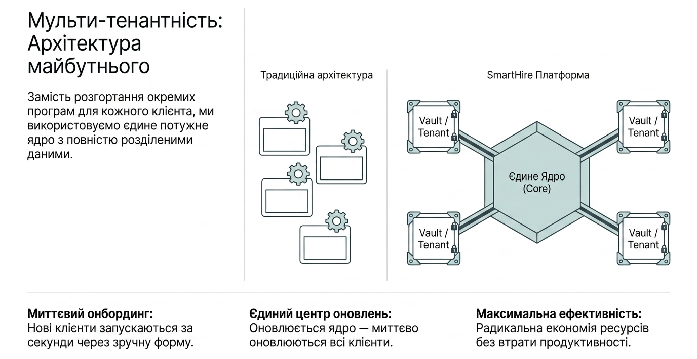
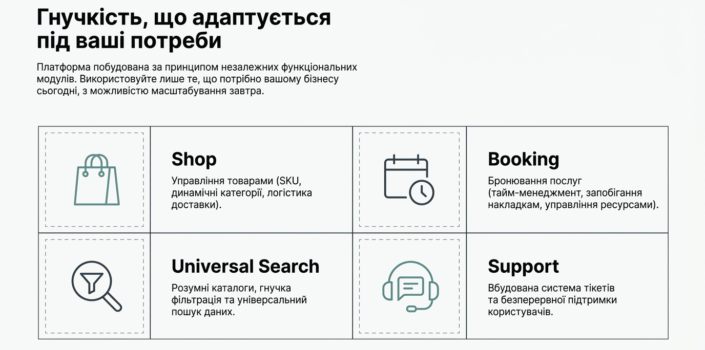
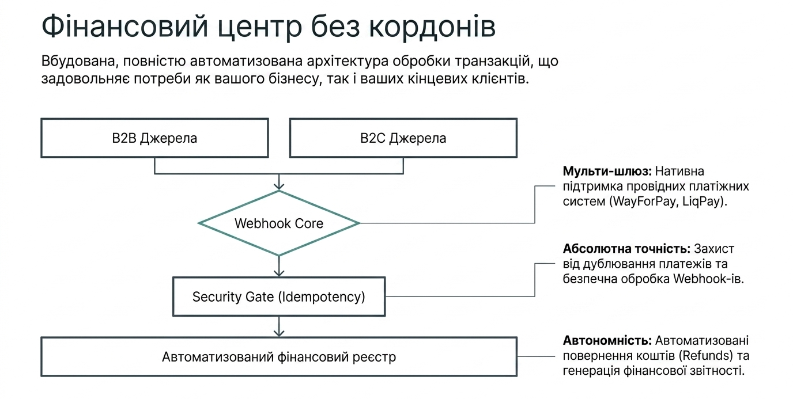
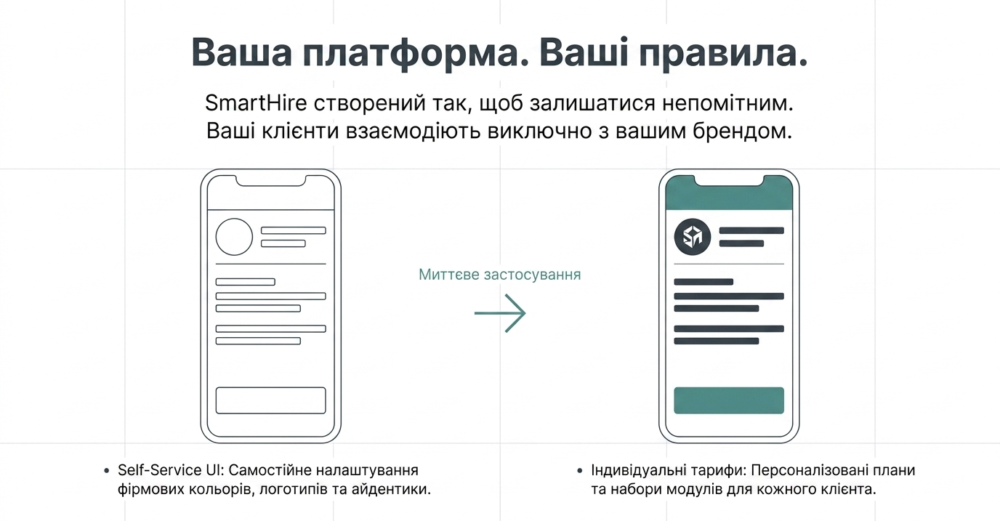
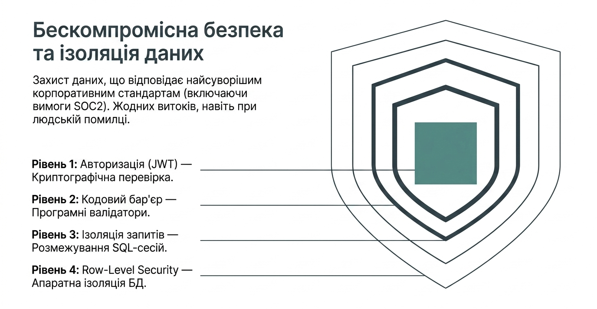
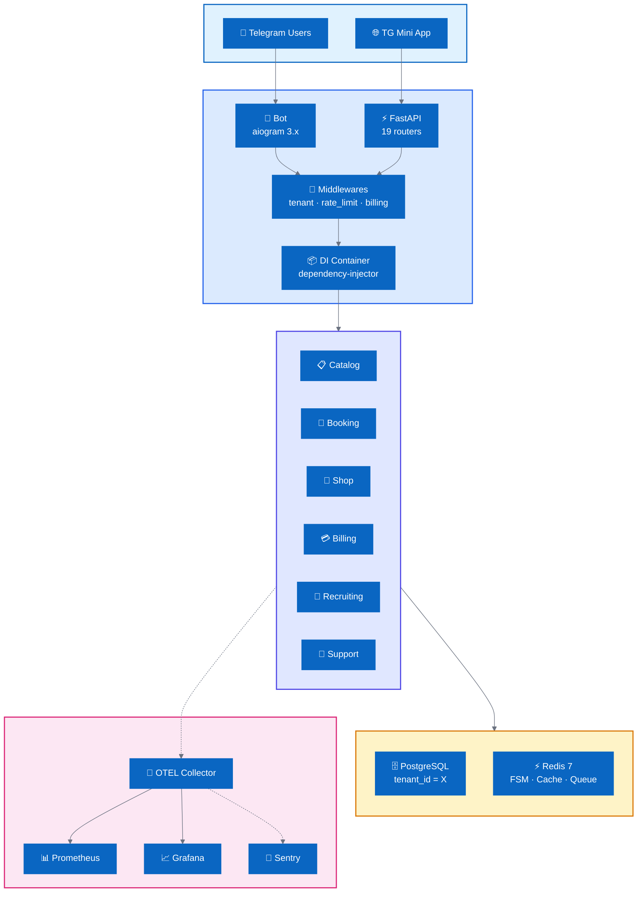

<div align="center">


# SmartHire Showcase

### Architecture patterns from a production Multi-tenant SaaS platform

Цей репозиторій демонструє підходи до побудови ізольованих B2B SaaS систем.
Фокус на **Multi-tenancy**, **безпеці транзакцій** та **AI-assisted розробці**.

[](pyproject.toml)
[](https://fastapi.tiangolo.com/)
[](https://docs.aiogram.dev/)
[](https://docs.sqlalchemy.org/)
[](dashboard/)
[](helm/smart-os/)
[](docs/infrastructure.md)

---

## 🎯 Чому SmartHire

Готовий **B2B SaaS-фундамент** для запуску Telegram-продуктів за днів, а не місяців.

<p align="center">
  <picture>
    <source media="(prefers-color-scheme: dark)" srcset="docs/assets/slide_7_multitenant.png">
    <source media="(prefers-color-scheme: light)" srcset="docs/assets/slide_7_multitenant.png">
    
  </picture>
</p>

| | Без SmartHire | Зі SmartHire |
|---|---|---|
| **Запуск нового бренду** | 2–3 місяці розробки | **5 хвилин** — YAML + Dashboard onboarding |
| **Платежі + звірка** | Власна інтеграція з банком | WayForPay / LiqPay + auto-reconciliation з коробки |
| **Масштаб до N клієнтів** | Копія коду під кожного | **Module Federation** + tenant isolation в одному runtime |
| **Білінг і підписки** | Ручне керування, Excel | `BillingLifecycle` + grace period + auto-pause |
| **Observability** | `print()` і grep по логах | OpenTelemetry + Prometheus + Grafana, tenant-aware метрики |
| **Безпека даних** | Plain-text у БД | AES-256 PII, HMAC callbacks, per-tenant RBAC, SQL-injection guard |

---

## 📸 Platform Preview
<details open>
<summary><b>View Dashboard, Architecture & Mobile UI</b></summary>
<br>

*(Скріншоти та демо готуються)*

</details>

---

## 👥 Для кого

- 🏢 **Рекрутингові агентства та HR-відділи** — CRM, воронка кандидатів, Excel-звіти.
- 💼 **B2B-інтегратори та агентства** — White Label для ваших клієнтів під ключ.
- 🚀 **SaaS-стартапи на Telegram** — повний стек (бот, FastAPI, React, K8s) замість MVP з нуля.
- 🧑‍💻 **Соло-підприємці** — монетизація через платні анкети/бронювання/магазин в одному боті.

---

## ✨ Що всередині

### 🏗 Платформа
<p align="center">
  <picture>
    <source media="(prefers-color-scheme: dark)" srcset="docs/assets/slide_3_modules.png">
    <source media="(prefers-color-scheme: light)" srcset="docs/assets/slide_3_modules.png">
    
  </picture>
</p>

- **Module Federation** — `core/modules/` + `BaseModule` + `ModuleRegistry`. Додати новий
  бізнес-напрямок (магазин, бронювання, авто) — **1–2 дні**, без змін у ядрі.
- **Strict Service Layer (Headless)** — хендлери ізольовані від БД, доменна логіка
   у `core/services/` (100% headless, [ADR-0032](docs/architecture/adr-0032-service-layer-enforcement.md)).
- **Multi-tenancy без компромісів** — `tenant_id` на рівні БД, `TenantQueryBuilder`,
  `@tenant_scoped`, distributed primitives на Redis, horizontal scaling.
- **Dependency Injection** (`dependency-injector`) — жодних глобальних імпортів сервісів.
- **Graceful startup/shutdown** — 10 startup-модулів у `core/startup/` з правильним
  порядком ініціалізації та teardown.

### 💳 Платежі та білінг
<p align="center">
  <picture>
    <source media="(prefers-color-scheme: dark)" srcset="docs/assets/slide_6_payments.png">
    <source media="(prefers-color-scheme: light)" srcset="docs/assets/slide_6_payments.png">
    
  </picture>
</p>

- **WayForPay + LiqPay** — повна реалізація з HMAC-підписами, IP-allowlist, idempotency.
- **Автоматична звірка з банком** — щоденна, Excel-звіт з Paid/Pending/Розбіжності.
- **BillingLifecycle + BillingScheduler** — підписки, grace period, автоматичне
  відключення бота при неоплаті, повернення після оплати.
- **Копійки замість float** — `core/payments/money.py`, жодних `0.1 + 0.2 != 0.3`.

### 🎨 White Label
<p align="center">
  <picture>
    <source media="(prefers-color-scheme: dark)" srcset="docs/assets/slide_5_whitelabel.png">
    <source media="(prefers-color-scheme: light)" srcset="docs/assets/slide_5_whitelabel.png">
    
  </picture>
</p>

- **YAML-конфігурації клієнтів** у `core/white_label/clients/` або DB-backed через
  `business_config` (перемикач `WHITE_LABEL_ENABLED`).
- Кастомізація: бренд, логотип, кольори, юридична особа, тарифи, канал, контакти,
  провайдер платежів, оферта/політика.
- **Необмежена кількість клієнтів** в одному runtime.

### 🖥 Інтерфейси
| Додаток | Стек | Порт | Призначення |
|---|---|---|---|
| `dashboard/` | React 19 + TS + shadcn/ui | **3000** | Control plane суперадміна (12+ сторінок) |
| `tg_miniapp/` | React + TS + FastAPI | **3001** | Telegram Mini App для клієнтських тенантів |
| `onboarding/` | React + лендинг | **3002** | Self-service onboarding нових тенантів |
| `helm_chart/` | React UI | **3003** | Візуальний Helm-конфігуратор |

### 🔐 Безпека
<p align="center">
  <picture>
    <source media="(prefers-color-scheme: dark)" srcset="docs/assets/slide_8_security.png">
    <source media="(prefers-color-scheme: light)" srcset="docs/assets/slide_8_security.png">
    
  </picture>
</p>

- **AES-256** для PII (телефони, чутливі поля).
- **HMAC** для admin `callback_data` — захист від підробки.
- **Pydantic v2** валідація всього вхідного трафіку.
- **Rate limiting** на Redis (tenant-scoped, per-API-key ready).
- **SQL Injection Guard** — `TenantQueryBuilder` + `sqlglot`, жодних raw-конкатенацій.
- **Маскування PII** у логах (`utils/masking.py`).
- **Feature flags** per-tenant — вимкнути небезпечну фічу у продакшені за секунди.

### 📊 Observability та якість
- **OpenTelemetry** (OTLP) — `core/telemetry.py`.
- **Prometheus exporter** — tenant-aware метрики (активні тенанти, payments TPS, DB
  latency histogram з OLTP-бакетами).
- **Grafana dashboard** — 11 панелей, auto-provisioning через Docker Compose.
- **Better Stack** — Logtail + Heartbeat для uptime/alerting.
- **Sentry** — error tracking.
- **Health / Readiness** endpoints для K8s probes.
- **Тестові піраміди** — unit, integration, property-based (`hypothesis`), load
  (`locust`), stress, smoke.

### 🚀 Deployment
- **Docker Compose** — dev / staging / prod / monitoring / multi-instance.
- **Kubernetes Helm chart** — `helm/smart-os/` з HPA (1–5 реплік),
  PodDisruptionBudget, Redis Sentinel, pre-install Alembic hook, security context
  (non-root, readOnlyRootFilesystem, drop capabilities).
- **Nginx / Caddy** multi-instance конфігурації.

---

## 🏛️ Архітектура



### Ключові патерни

| # | Патерн | Опис |
|---|--------|------|
| 1 | **Multi-Tenant Isolation** | `TenantQueryBuilder` → `WHERE tenant_id = X` |
| 2 | **Module Federation** | Новий бізнес-напрямок за 1–2 дні |
| 3 | **Billing State Machine** | Trial → Active → Grace → Paused |
| 4 | **Money as Integers** | `to_kopecks()` замість float |
| 5 | **PII Masking** | `mask_pii()` для безпечних логів |

---

## 💎 Код та архітектурні рішення

Я закрив вихідний код з комерційних причин, але виділив ключові архітектурні патерни для цього showcase. Почніть тут:

1. **[Ізоляція тенантів](code/tenant_query_builder.py)** — Як ми запобігаємо витоку даних між тенантами за допомогою PostgreSQL Row-Level Security та FastAPI middlewares.
2. **[Фінансова точність](code/money.py)** — Реалізація арифметики на базисних пунктах та Idempotency engine, що запобігає подвійному списанню коштів.
3. **[Architecture Decision Records (ADRs)](adr/)** — Читайте мої інженерні записи (наприклад, *[ADR-0032: Service Layer Enforcement](adr/0032_service_layer_enforcement.md)* або *[ADR-001: Multi-Tenant Architecture](adr/001_multi_tenant_architecture.md)*).

---

## 🛠 Tech Stack

| Категорія | Технології |
|-----------|------------|
| **Backend** | Python 3.12+, aiogram 3.26, FastAPI 0.135, aiohttp 3.13 |
| **Data** | SQLAlchemy 2.0 async, asyncpg, PostgreSQL 14+, Redis 7 |
| **Frontend** | React 19, TypeScript ~5.8, Vite, shadcn/ui, TailwindCSS |
| **DevOps** | Docker Compose, Kubernetes Helm, uv, ruff, mypy, pytest |
| **Observability** | OpenTelemetry, Prometheus, Grafana, Sentry, Better Stack |

---

## ❓ FAQ

<details>
<summary><strong>Чим SmartHire відрізняється від звичайного Telegram-бота?</strong></summary>

Це не бот, а **SaaS-платформа**: multi-tenant runtime, білінг, Module Federation,
React Dashboard, Helm chart, Prometheus/OTEL. Telegram — лише один із каналів.
</details>

<details>
<summary><strong>Чому PostgreSQL, а не SQLite?</strong></summary>

Multi-tenancy, паралельні транзакції, JSONB-операції, `SELECT FOR UPDATE SKIP LOCKED`,
реплікація. SQLite використовувався у Phase 1–2; повністю мігровано у Phase 3.0.
</details>

<details>
<summary><strong>Скільки клієнтів тримає один runtime?</strong></summary>

Протестовано **1000+ тенантів** без degradation > 20% (Phase 3.2, Redis Sentinel +
3 bot-реплики). Подальше масштабування — через K8s HPA.
</details>

<details>
<summary><strong>Як захищені персональні дані?</strong></summary>

AES-256 у БД (ключ + сіль у `.env`), маскування у логах (`mask_pii()`), Pydantic
валідація на вході, PII ніколи не потрапляє у Sentry/Logtail у сирому вигляді.
</details>

---

## 🤖 AI-Assisted Development

SmartHire використовує системний підхід до AI-розробки з автоматизованими quality gates.

### .windsurfrules Protocol

```markdown
## Identity & Stack
Role: Senior Python Developer & QA Automation Engineer.
Stack: Python 3.12+, `uv`, Aiogram 3.x, SQLAlchemy 2.0 (async), React 19/TS.

## Quality Gate
Task is DONE only when:
1. `ruff check . --fix` and `ruff format .` pass
2. Local tests for the changed module are green
3. `mypy` passes without errors
```

---

## 📄 Ліцензія

**Proprietary — вихідний код закритий.** Архітектурні патерни публікуються **виключно для освітніх цілей**.

- ❌ Використання вихідного коду у комерційних продуктах — **заборонено**
- ❌ Копіювання, модифікація та дистрибуція коду — **заборонено**
- ✅ Вивчення архітектурних підходів та патернів — **дозволено**
- ✅ Посилання на цей репозиторій як джерело ідей — **дозволено**

Для отримання комерційної ліцензії зверніться до власника проекту.

---

## 📬 Давайте поспілкуємось

Якщо ви B2B-бізнес, який шукає автоматизацію процесів, або Tech Lead, який збирає сильну інженерну команду — я відкритий до діалогу.

* **LinkedIn:** [Andrew Rymarevsky](https://www.linkedin.com/in/andrewrymar)
* **Email:** rimarevskiy@gmail.com
* **Telegram:** [andrewrymar](https://t.me/andrewrymar)

*Я створюю системи, що витримують експоненційне зростання, математично захищають гроші клієнтів та дозволяють інженерним командам спокійно спати.*

---

<div align="center">

**Built with architectural patterns from production SaaS**

</div>
